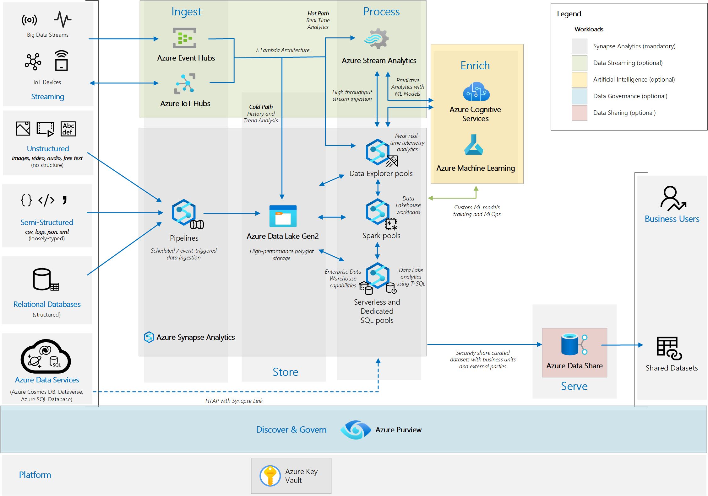
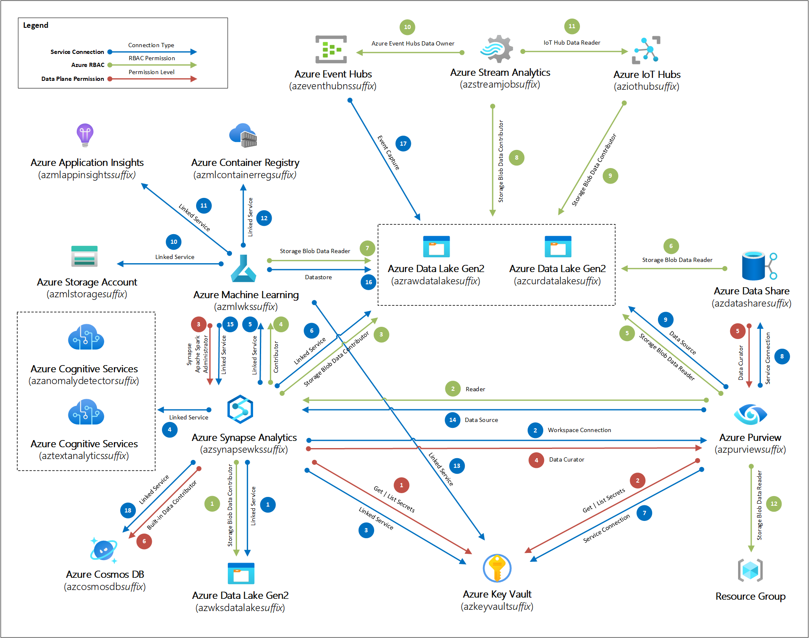
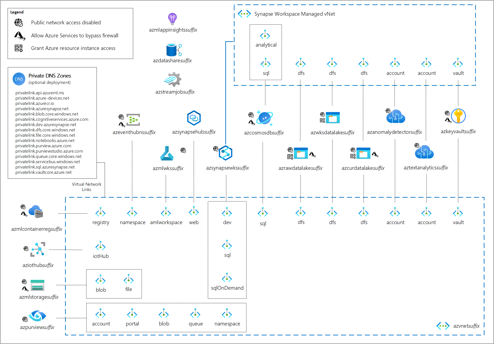

# Azure Analytics End to End with Azure Synapse - Deployment Accelerator

## Overview

This is a deployment accelerator based on the reference architecture described in the Azure Architecture Center article [Analytics end-to-end with Azure Synapse](https://docs.microsoft.com/azure/architecture/example-scenario/dataplate2e/data-platform-end-to-end). This deployment accelerator aims to automate not only the deployment of the services covered by the reference architecture, but also to fully automate the configuration and permissions required for the services to work together. The deployed architecture enables the end-to-end analytics platform capable of handling the most common uses cases for most organizations.

The implementation of this deployment accelerator is done through the use of [Azure Bicep](https://github.com/Azure/bicep), a domain-specific language (DSL) that uses declarative syntax to deploy Azure resources.


## Deploy

Before you hit the deploy button, make sure you review the details about the services deployed.

[](https://portal.azure.com/#blade/Microsoft_Azure_CreateUIDef/CustomDeploymentBlade/uri/https%3A%2F%2Fraw.githubusercontent.com%2FAzure%2Fazure-synapse-analytics-end2end%2Fmain%2FDeploy%2FAzureAnalyticsE2E.json/uiFormDefinitionUri/https%3A%2F%2Fraw.githubusercontent.com%2FAzure%2Fazure-synapse-analytics-end2end%2Fmain%2FDeploy%2FcreateUiDefinition.json)

> **Note:** The "Deploy to Azure" button above will redirect you to the Azure Portal with a reference to the resulting [ARM template file](./Deploy/AzureAnalyticsE2E.json) generated by the build of the Bicep code. Please refer to Bicep files for the true source of the code for this accelerator.

You can also use Azure CLI to deploy the services:

For a full deployment of all workloads with public endpoints use the command below:

```azurecli
az deployment group create --resource-group resource-group-name --template-file ./AzureAnalyticsE2E.bicep --parameters synapseSqlAdminPassword=use-complex-password-here
```

For a full deployment of all workloads with vNet integrated endpoints use the command below:

```azurecli
az deployment group create --resource-group resource-group-name --template-file ./AzureAnalyticsE2E.bicep --parameters networkIsolationMode=vNet synapseSqlAdminPassword=use-complex-password-here
```

You can have more control over the deployment by providing values to optional template parameters in the form of:
```azurecli
az deployment group create --resource-group resource-group-name --template-file ./AzureAnalyticsE2E.bicep --parameters synapseSqlAdminPassword=use-complex-password-here param1=value1 param2=value2...
```
> **Important:** This deployment accelerator is meant to be executed under no interference from Azure Policies that deny certain configurations as they might prevent the its successful completion. Please use a sandbox environment if you need to validate the deployment resulting configuration before you run it against other environments under Azure Policies.

> **Important:** This deployment accelerator implements some service features that are still in Public Preview. Please consider those before you plan for a production deployment.

### Required Resource Providers

The target subscription for the deployment accelerator needs to have the following resource providers enabled before the deployment execution:

* Microsoft.Synapse
* Microsoft.Purview
* Microsoft.MachineLearningServices
* Microsoft.ContainerRegistry
* Microsoft.Network
* Microsoft.DataShare
* Microsoft.Authorization
* Microsoft.CognitiveServices
* Microsoft.ManagedIdentity
* Microsoft.KeyVault
* Microsoft.Storage
* Microsoft.StreamAnalytics
* Microsoft.Devices
* Microsoft.Insights
* Microsoft.EventHub

### Deployment Details

The deployment accelerator can be deployed in two network isolation modes: **default** or **vNet**.

Network Isolation Mode | Description
-----------------------|-------------
**default**            |Deploys the selected components to Azure using public endpoints.
**vNet**               |Deploys the selected components to Azure and the additional services to support private connectivity and restricted inter-service connectivity where possible. This includes provisioning and configuration of virtual networks, managed virtual network deployments for Azure Synapse Analytics, the private endpoints for all services that support Private Link and the supporting Private DNS Zones.

### Azure Services Provisioned

The scope of this deployment accelerator is illustrated in the diagram below.



> **Important:** All services are deployed in a single resource group and in the same region as the resource group. Before creating the resource group that will host the workloads, check the [Azure Products by Region](https://azure.microsoft.com/global-infrastructure/services/?products=purview,key-vault,virtual-network,data-share,event-hubs,cognitive-services,storage,iot-hub,container-registry,synapse-analytics,stream-analytics,machine-learning-service&regions=all) and select a region that has all selected services available. The deployment will fail if any of the services is not available in the chosen region.


> **Important:** For a fully automated deployment and configuration of Synapse Analytics and Purview the deployment accelerator makes use of post-deployment PowerShell scripts to perform data plane operations. The operations executed by these scripts are to execute operations to complement the final environment configuration as not every setring is available through Bicep. Because of these imperative actions executed by the scripts, the template is no longer idempotent and should only be used for initial deployment and configuration. For more details about the scripts see the deployment accelerator documentation.

The default pricing tier for all services are provisioned are their lowest possible to meet the initial deployment requirements. If you choose to provide different different values to the input parameters, please observe the pricing information for each service in the table below.

If explicit names are not provided, all services names will be appended with a unique 5-letter *suffix* to ensure name uniqueness in Azure.

The Azure services used in the architecture above have been divided into **workloads** (see workload tables below) that can be conditionally deployed based on input parameters. The only mandatory workload is Synapse Analytics represented in the grey box in the diagram above.

#### Platform Services

Name                           | Type                      | Default Pricing Tier                                                                |Conditional  |Notes
-------------------------------|---------------------------|-------------------------------------------------------------------------------------|-------------|------------
az-*resource group name*-uami  |Managed Identity           | N/A                                                                                 | No          | Required to run post-deployment scripts. It is deleted by clean-up post deployment script.
azkeyvault*suffix*             |Key vault                  | [Standard A](https://azure.microsoft.com/pricing/details/key-vault/#pricing)        | No          |

#### Synapse Analytics

Name                           | Type                      | Default Pricing Tier                                                                            | Conditional  |Notes
-------------------------------|---------------------------|-------------------------------------------------------------------------------------------------|--------------|------------
azsynapsewks*suffix*           |Synapse workspace          | [N/A](https://azure.microsoft.com/pricing/details/synapse-analytics/#pricing)                   | No           | Default workspace deployment doesn't incur costs.
SparkCluster                   |Apache Spark pool          | [Small (3 nodes)](https://azure.microsoft.com/pricing/details/synapse-analytics/#pricing)       | Yes          |
EnterpriseDW                   |Synapse SQL pool           | [DW100](https://azure.microsoft.com/pricing/details/synapse-analytics/#pricing)                 | Yes          |
adxpool*suffix*                |Data Explorer pool         | [Extra Small (2 nodes)](https://azure.microsoft.com/pricing/details/synapse-analytics/#pricing) | Yes          |
azwksdatalake*suffix*          |Storage account            | [Standard LRS](https://azure.microsoft.com/pricing/details/storage/blobs/)                      | No           |
azrawdatalake*suffix*          |Storage account            | [Standard GRS](https://azure.microsoft.com/pricing/details/storage/blobs/)                      | No           |
azcurateddatalake*suffix*      |Storage account            | [Standard GRS](https://azure.microsoft.com/pricing/details/storage/blobs/)                      | No           |
SynapsePostDeploymentScript    |Deployment Script          | N/A                                                                                             | No           | Deployment script resources will be automatically deleted after 24hs.

#### Data Governance

Name                           | Type                      | Default Pricing Tier                                                                   | Conditional  |Notes
-------------------------------|---------------------------|----------------------------------------------------------------------------------------|--------------|------------
azpurview*suffix*              |Purview account            | [1 Capacity Unit](https://azure.microsoft.com/pricing/details/azure-purview/#pricing)  | Yes          |
PurviewPostDeploymentScript    |Deployment Script          | N/A                                                                                    | Yes          | Deployment script resources will be automatically deleted after 24hs.

#### Artificial Intelligence (AI)

Name                           | Type                      | Default Pricing Tier                                                                                     | Conditional  |Notes
-------------------------------|---------------------------|----------------------------------------------------------------------------------------------------------|--------------|------------
azanomalydetector*suffix*      |Anomaly detector           | [Standard](https://azure.microsoft.com/pricing/details/cognitive-services/anomaly-detector/#pricing)     | Yes          |
aztextanalytics*suffix*        |Language                   | [Standard](https://azure.microsoft.com/pricing/details/cognitive-services/language-service/#pricing)     | Yes          |
azmlwks*suffix*                |Machine learning workspace | [N/A](https://azure.microsoft.com/pricing/details/machine-learning/#pricing)                             | Yes          | Default workspace deployment doesn't incur costs.
azmlstorage*suffix*            |Storage account            | [Standard LRS](https://azure.microsoft.com/pricing/details/storage/blobs/)                               | Yes          |
azmlcontainerreg*suffix*       |Container registry         | [Basic or Premium (see notes)](https://azure.microsoft.com/pricing/details/container-registry/#pricing)  | Yes          | [Premium service tier required for private link support](https://docs.microsoft.com/azure/container-registry/container-registry-private-link#prerequisites)
azmlappinsights*suffix*        |Application Insights       | [On-demand data ingestion charges](https://azure.microsoft.com/pricing/details/monitor/#pricing)         | Yes          |

#### Data Sharing

Name                           | Type                      | Default Pricing Tier                                                                              | Conditional  |Notes
-------------------------------|---------------------------|---------------------------------------------------------------------------------------------------|--------------|------------
azdatashare*suffix*            |Data Share                 | [On-demand data processing charges](https://azure.microsoft.com//pricing/details/data-share/)     | Yes          |

#### Streaming

Name                           | Type                      | Default Pricing Tier                                                       | Conditional  |Notes
-------------------------------|---------------------------|----------------------------------------------------------------------------|--------------|------------
azeventhubns*suffix*           |Event Hub namespace        | [Basic](https://azure.microsoft.com/pricing/details/event-hubs/)           | Yes          |
aziothub*suffix*               |IoT Hub                    | [Free](https://azure.microsoft.com/pricing/details/iot-hub/)               | Yes          |
azstreamjob*suffix*            |Stream Analytics job       | [Standard](https://azure.microsoft.com/pricing/details/stream-analytics/)  | Yes          |

## Integration and Permissions



Beyond the deployment of the services that make up the reference architecture, this template also automates the configuration of connections and permissions between the services in order for the to work properly. Every arrow you see in the diagram above represents a configuration step that has been automated for you saving you a lot of time to get to insights.

Each connection and permission in the list below has been implemented following the technical documentation for the services involved below. Check the reference documentation links below for more information about them.

### Service Connections

These are the service connections explicitly defined in deployment accelerator template. These connections represent the necessary configuration for the services to be fully integrated and work well together.
Note that these connections may result in implicit RBAC permissions set between resources participating in the connection that are not in the permission list below. Check the reference documentation of each service connection below for more information.

ID                                  | From Service         | To Service                                         | Connection Type      | Reference Documentation
------------------------------------|----------------------|----------------------------------------------------|----------------------|--------------------------
 | azsynapsewks*suffix* | azwksdatalake*suffix*                              | Linked Service       | [Control storage account access for serverless SQL pool in Azure Synapse Analytics](https://docs.microsoft.com/azure/synapse-analytics/sql/develop-storage-files-storage-access-control)
 | azsynapsewks*suffix* | azpurview*suffix*                                  | Workspace Connection | [Connect a Synapse workspace to an Azure Purview account](https://docs.microsoft.com/azure/synapse-analytics/catalog-and-governance/quickstart-connect-azure-purview)
 | azsynapsewks*suffix* | azkeyvault*suffix*                                 | Linked Service       | [Store credential in Azure Key Vault](https://docs.microsoft.com/azure/data-factory/store-credentials-in-key-vault)
 | azsynapsewks*suffix* | azanomalydetector*suffix*, aztextanalytics*suffix* | Linked Service       | [Configure prerequisites for using Cognitive Services in Azure Synapse Analytics](https://docs.microsoft.com/azure/synapse-analytics/machine-learning/tutorial-configure-cognitive-services-synapse)
 | azsynapsewks*suffix* | azmlwks*suffix*                                    | Linked Service       | [Create a new Azure Machine Learning linked service in Synapse](https://docs.microsoft.com/azure/synapse-analytics/machine-learning/quickstart-integrate-azure-machine-learning)
 | azsynapsewks*suffix* | azrawdatalake*suffix*, azcurateddatalake*suffix*   | Linked Service       | [Control storage account access for serverless SQL pool in Azure Synapse Analytics](https://docs.microsoft.com/azure/synapse-analytics/sql/develop-storage-files-storage-access-control)
 | azpurview*suffix*    | azkeyvault*suffix*                                 | Service Connection   | [Credentials for source authentication in Azure Purview](https://docs.microsoft.com/azure/purview/manage-credentials)
 | azpurview*suffix*    | azdatashare*suffix*                                | Service Connection   | [How to connect Azure Data Share and Azure Purview](https://docs.microsoft.com/azure/purview/how-to-link-azure-data-share)
 | azpurview*suffix*    | azrawdatalake*suffix*, azcurateddatalake*suffix*   | Data Source          | [Connect to Azure Data Lake Gen2 in Azure Purview](https://docs.microsoft.com/azure/purview/register-scan-adls-gen2)
 | azmlwks*suffix*      | azmlstorage*suffix*                                | Linked Service       | [Connect to storage services on Azure](https://docs.microsoft.com/azure/machine-learning/how-to-access-data#prerequisites)
 | azmlwks*suffix*      | azmlappinsights*suffix*                            | Linked Service       | [Monitor and collect data from ML web service endpoints](https://docs.microsoft.com/azure/machine-learning/how-to-enable-app-insights)
 | azmlwks*suffix*      | azmlcontainerreg*suffix*                           | Linked Service       | [Manage Azure Machine Learning workspaces in the portal or with the Python SDK](https://docs.microsoft.com/azure/machine-learning/how-to-manage-workspace)
 | azmlwks*suffix*      | azkeyvault*suffix*                                 | Linked Service       | [Use authentication credential secrets in Azure Machine Learning training runs](https://docs.microsoft.com/azure/machine-learning/how-to-use-secrets-in-runs)
 | azpurview*suffix*    | azsynapsewks*suffix*                               | Data Source          | [Connect to and manage Azure Synapse Analytics workspaces in Azure Purview](https://docs.microsoft.com/azure/purview/register-scan-synapse-workspace)
 | azmlwks*suffix*      | azsynapsewks*suffix*                               | Linked Service       | [Link Azure Synapse Analytics and Azure Machine Learning workspaces and attach Apache Spark pools](https://docs.microsoft.com/azure/machine-learning/how-to-link-synapse-ml-workspaces)
 | azmlwks*suffix*      | azrawdatalake*suffix*, azcurateddatalake*suffix*   | Datastore            | [Connect to storage services on Azure](https://docs.microsoft.com/azure/machine-learning/how-to-access-data)
 | azeventhubns*suffix* | azrawdatalake*suffix*                              | Event Capture        | [Capture events through Azure Event Hubs in Azure Blob Storage or Azure Data Lake Storage](https://docs.microsoft.com/azure/event-hubs/event-hubs-capture-overview)

### Azure Role Based Access Control (RBAC) Permissions

Beyond the service connections created above, the deployment accelerator template defined Azure RBAC permissions between the services. These are the minimum level of permissions granted to their system-assigned identity (MSI) for the integration to function properly.
These are the Azure RBAC permissions explicitly set by the template and the reason for these permissions to exist is describer in the reference documentation for each one of them.

ID                                    | Granted To Service   | Granted On Service                                 | Permission Level                        | Reference Documentation
--------------------------------------|----------------------|----------------------------------------------------|-----------------------------------------|--------------------------
 | azsynapsewks*suffix* | azwksdatalake*suffix*                              | Storage Blob Data Contributor           | [Grant permissions to workspace managed identity](https://docs.microsoft.com/azure/synapse-analytics/security/how-to-grant-workspace-managed-identity-permissions)
 | azpurview*suffix*    | azsynapsewks*suffix*                               | Reader                                  | [Connect to and manage Azure Synapse Analytics workspaces in Azure Purview](https://docs.microsoft.com/azure/purview/register-scan-synapse-workspace#authentication-for-enumerating-serverless-sql-database-resources)
 | azsynapsewks*suffix* | azrawdatalake*suffix*, azcurateddatalake*suffix*   | Storage Blob Data Contributor           | [Grant permissions to workspace managed identity](https://docs.microsoft.com/azure/synapse-analytics/security/how-to-grant-workspace-managed-identity-permissions)
 | azsynapsewks*suffix* | azmlwks*suffix*                                    | Contributor                             | [Create a new Azure Machine Learning linked service in Synapse](https://docs.microsoft.com/azure/synapse-analytics/machine-learning/quickstart-integrate-azure-machine-learning#give-msi-permission-to-the-azure-ml-workspace)
 | azpurview*suffix*    | azrawdatalake*suffix*, azcurateddatalake*suffix*   | Storage Blob Data Reader                | [Connect to Azure Data Lake Gen2 in Azure Purview](https://docs.microsoft.com/azure/purview/register-scan-adls-gen2#using-a-system-or-user-assigned-managed-identity-for-scanning)
 | azdatashare*suffix*  | azrawdatalake*suffix*, azcurateddatalake*suffix*   | Storage Blob Data Reader                | [Roles and requirements for Azure Data Share](https://docs.microsoft.com/azure/data-share/concepts-roles-permissions)
 | azmlwks*suffix*      | azrawdatalake*suffix*, azcurateddatalake*suffix*   | Storage Blob Data Reader                | [Connect to storage by using identity-based data access](https://docs.microsoft.com/azure/machine-learning/how-to-identity-based-data-access)
 | azstreamjob*suffix*  | azrawdatalake*suffix*, azcurateddatalake*suffix*   | Storage Blob Data Contributor           | [Use Managed Identity to authenticate your Azure Stream Analytics job to Azure Blob Storage](https://docs.microsoft.com/azure/stream-analytics/blob-output-managed-identity#grant-access-via-the-azure-portal)
 | aziothub*suffix*     | azrawdatalake*suffix*, azcurateddatalake*suffix*   | Storage Blob Data Contributor           |
 | azstreamjob*suffix*  | azeventhubns*suffix*                               | Event Hub Data Owner                    | [Use managed identities to access Event Hub from an Azure Stream Analytics job](https://docs.microsoft.com/azure/stream-analytics/event-hubs-managed-identity#grant-the-stream-analytics-job-permissionsto-access-the-event-hub)
 | azstreamjob*suffix*  | aziothub*suffix*                                   | IoT Hub Data Receiver                   | [Control access to IoT Hub by using Azure Active Directory](https://docs.microsoft.com/azure/iot-hub/iot-hub-dev-guide-azure-ad-rbac#manage-access-to-iot-hub-by-using-azure-rbac-role-assignment)
 | azpurview*suffix*    | Resource Group                                     | Storage Blob Data Reader                | [Connect to and manage Azure Synapse Analytics workspaces in Azure Purview](https://docs.microsoft.com/azure/purview/register-scan-synapse-workspace#authentication-for-enumerating-serverless-sql-database-resources)

### Data Plane Permissions

ID                                    | Granted to Service   | Granted On Service                                 | Permission Level                   | Reference Documentation
--------------------------------------|----------------------|----------------------------------------------------|------------------------------------|--------------------------
     | azsynapsewks*suffix* | azkeyvault*suffix*                                 | Get and List Secrets               | [Use Azure Key Vault secrets in pipeline activities](https://docs.microsoft.com/azure/data-factory/how-to-use-azure-key-vault-secrets-pipeline-activities)
     | azpurview*suffix*    | azkeyvault*suffix*                                 | Get and List Secrets               | [Credentials for source authentication in Azure Purview](https://docs.microsoft.com/azure/purview/manage-credentials#grant-azure-purview-access-to-your-azure-key-vault)
     | azmlwks*suffix*      | azsynapsewks*suffix*                               | Synapse Apache Spark Administrator | [Link Azure Synapse Analytics and Azure Machine Learning workspaces and attach Apache Spark pools](https://docs.microsoft.com/azure/machine-learning/how-to-link-synapse-ml-workspaces)
     | azsynapewks*suffix*  | azpurview*suffix*                                  | Data Curator                       | [Connect a Synapse workspace to an Azure Purview account](https://docs.microsoft.com/azure/synapse-analytics/catalog-and-governance/quickstart-connect-azure-purview#set-up-authentication)
     | azdatashare*suffix*  | azpurview*suffix*                                  | Data Curator                       | [How to connect Azure Data Share and Azure Purview](https://docs.microsoft.com/azure/purview/how-to-link-azure-data-share)

## Networking Architecture

If you choose for a 'vNet Integrated' network isolation mode then the following applies:

* The Synapse Workspace will be deployed with a Managed Virtual Network.
* Managed private endpoints for some of the services will be created in the Synapse Workspace managed virtual network.
* Either a new or an existing virtual network will be used to deploy the private endpoints for all services in the architecture that support Private Link.
* Public access will be disabled and firewall rules will be set to restrict connectivity to and from the virtual network and between the services in the architecture.
* Private DNS zones required by the different private link domains can be optionally deployed and linked to the selected virtual network.



The following extra services will be deployed to support the private connectivity configuration:

Component        |Name                               | Type                    |Optional
-----------------|-----------------------------------|-------------------------|--------------------
Synapse Analytics|privatelink.azuresynapse.net       |Private DNS Zone         |Yes
Synapse Analytics|privatelink.dev.azuresynapse.net   |Private DNS Zone         |Yes
Synapse Analytics|privatelink.azuresynapse.net       |Private DNS Zone         |Yes
Synapse Analytics|privatelink.sql.azuresynapse.net   |Private DNS Zone         |Yes
Synapse Analytics|privatelink.dfs.core.windows.net   |Private DNS Zone         |Yes
Synapse Analytics|privatelink.vaultcore.azure.net    |Private DNS Zone         |Yes
AI               |privatelink.api.azureml.ms         |Private DNS Zone         |Yes
AI               |privatelink.azurecr.io             |Private DNS Zone         |Yes
AI               |privatelink.file.core.windows.net  |Private DNS Zone         |Yes
AI               |privatelink.notebooks.azure.net    |Private DNS Zone         |Yes
Data Governance  |privatelink.queue.core.windows.net |Private DNS Zone         |Yes
Data Governance  |privatelink.servicebus.windows.net |Private DNS Zone         |Yes
Data Governance  |privatelink.blob.core.windows.net  |Private DNS Zone         |Yes
Data Governance  |privatelink.purview.azure.com      |Private DNS Zone         |Yes
Streaming        |privatelink.azure-devices.net      |Private DNS Zone         |Yes
Synapse Analytics|azvnet*suffix*                     |Virtual Network          |No
Synapse Analytics|azsynapsehub*suffix*               |Synapse private link hub |No
Synapse Analytics|azsynapsewks*suffix*-web           |Private Endpoint         |No
Synapse Analytics|azsynapsewks*suffix*-sqlserverless |Private Endpoint         |No
Synapse Analytics|azsynapsewks*suffix*-sql           |Private Endpoint         |No
Synapse Analytics|azsynapsewks*suffix*-dev           |Private Endpoint         |No
Synapse Analytics|azkeyvault*suffix*                 |Private Endpoint         |No
Synapse Analytics|azwksdatalake*suffix*-dfs          |Private Endpoint         |No
Synapse Analytics|azrawdatalake*suffix*-dfs          |Private Endpoint         |No
Synapse Analytics|azcurateddatalake*suffix*-dfs      |Private Endpoint         |No
Data Governance  |azpurview*suffix*-queue            |Private Endpoint         |No
Data Governance  |azpurview*suffix*-portal           |Private Endpoint         |No
Data Governance  |azpurview*suffix*-namespace        |Private Endpoint         |No
Data Governance  |azpurview*suffix*-blob             |Private Endpoint         |No
Data Governance  |azpurview*suffix*-account          |Private Endpoint         |No
AI               |aztextanalytics*suffix*-account    |Private Endpoint         |No
AI               |azanomalydetector*suffix*-account  |Private Endpoint         |No
AI               |azmlwks*suffix*-amlworkspace       |Private Endpoint         |No
AI               |azmlstorage*suffix*-file           |Private Endpoint         |No
AI               |azmlstorage*suffix*-blob           |Private Endpoint         |No
AI               |azmlcontainerreg*suffix*-registry  |Private Endpoint         |No
Streaming        |azeventhubns*suffix*-namespace     |Private Endpoint         |No
Streaming        |azeiothub*suffix*-iothub           |Private Endpoint         |No

Beyond the extra services above required to support the network isolation mode, the following network settings are applied to the services:


Workload         |Name                           |Type                       |Network Settings                                                                                                                      |Notes                                                                                                                          | Reference Documentation
-----------------|-------------------------------|---------------------------|--------------------------------------------------------------------------------------------------------------------------------------|-------------------------------------------------------------------------------------------------------------------------------|---------------------------------
Platform Services|azkeyvault*suffix*             |Key vault                  |                                         |'Allow Azure Services' required for access from Azure Purview and Azure ML                                                     |[Configure Azure Key Vault networking settings](https://docs.microsoft.com/azure/key-vault/general/how-to-azure-key-vault-network-security?tabs=azure-portal)
Synapse Analytics|azsynapsewks*suffix*           |Synapse workspace          |                                                                                   |[Managed Virtual Network enabled](https://docs.microsoft.com/azure/synapse-analytics/security/synapse-workspace-managed-vnet)  |[Understanding Azure Synapse Private Endpoints](https://techcommunity.microsoft.com/t5/azure-architecture-blog/understanding-azure-synapse-private-endpoints/ba-p/2281463)
Synapse Analytics|azwksdatalake*suffix*          |Storage account            |                                              |                                                                                                                               |[Configure Azure Storage firewalls and virtual networks](https://docs.microsoft.com/azure/storage/common/storage-network-security)
Synapse Analytics|azrawdatalake*suffix*          |Storage account            |    |'Allow Azure Services' enabled only when deploying Streaming workloads with Event Hubs                                         |[Configure Azure Storage firewalls and virtual networks](https://docs.microsoft.com/azure/storage/common/storage-network-security)
Synapse Analytics|azcurateddatalake*suffix*      |Storage account            |    |'Allow Azure Services' enabled only when deploying Streaming workloads with Event Hubs                                         |[Configure Azure Storage firewalls and virtual networks](https://docs.microsoft.com/azure/storage/common/storage-network-security)
Data Governance  |azpurview*suffix*              |Purview account            |                                                                                   |                                                                                                                               |[Connect to your Azure Purview and scan data sources privately and securely](https://docs.microsoft.com/azure/purview/catalog-private-link-end-to-end)
AI               |azanomalydetector*suffix*      |Anomaly detector           |                                                                                   |                                                                                                                               |[Configure Azure Cognitive Services virtual networks](https://docs.microsoft.com/azure/cognitive-services/cognitive-services-virtual-networks)
AI               |aztextanalytics*suffix*        |Language                   |                                                                                   |                                                                                                                               |[Configure Azure Cognitive Services virtual networks](https://docs.microsoft.com/azure/cognitive-services/cognitive-services-virtual-networks)
AI               |azmlwks*suffix*                |Machine learning workspace |                                                                                   |                                                                                                                               |[Secure Azure Machine Learning workspace resources using virtual networks (VNets)](https://docs.microsoft.com/azure/machine-learning/how-to-network-security-overview)
AI               |azmlstorage*suffix*            |Storage account            |                                         |                                                                                                                               |[Secure an Azure Machine Learning workspace with virtual networks](https://docs.microsoft.com/azure/machine-learning/how-to-secure-workspace-vnet?tabs=pe#secure-azure-storage-accounts)
AI               |azmlcontainerreg*suffix*       |Container registry         |                                         |                                                                                                                               |[Secure an Azure Machine Learning workspace with virtual networks](https://docs.microsoft.com/azure/machine-learning/how-to-secure-workspace-vnet?tabs=pe#enable-azure-container-registry-acr)
Streaming        |azeventhubns*suffix*           |Event Hub namespace        |                                         |                                                                                                                               |[Network security for Azure Event Hubs](https://docs.microsoft.com/azure/event-hubs/network-security)
Streaming        |aziothub*suffix*               |IoT Hub                    |                                                                                                                                  |                                                                                                                               |[IoT Hub support for virtual networks with Private Link and Managed Identity](https://docs.microsoft.com/azure/iot-hub/virtual-network-support)
Streaming        |azstreamjob*suffix*            |Stream Analytics job       |                                                                                                                                      |Stream Analytics Jobs don't support vNet integration. For that you should use [Stream Analytics Clusters](https://docs.microsoft.com/azure/stream-analytics/cluster-overview)|

## Contributing

If you would like to contribute to the solution (log bugs, issues, or add code) we have details on how to do that in our [CONTRIBUTING.md](./CONTRIBUTING.md) file.

## License

Details on licensing for the project can be found in the [LICENSE](./LICENSE) file.
